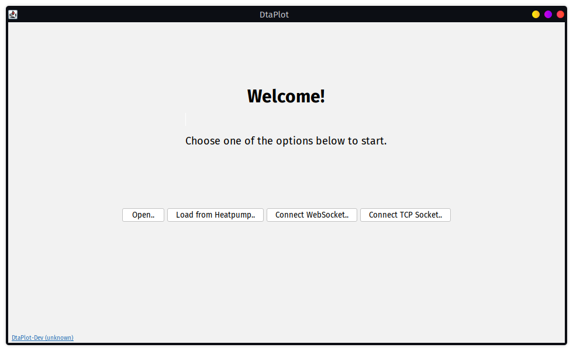

# DtaPlot

Plotting/Visualizing software for data of 
Luxtronik heatpump controllers.

### Features

This program fetches data from the `/proclog` or `/NewProc` http endpoints
exposed by the heatpump controller.
Analog Data is then displayed in the plot on the left as a graph
while digital data is displayed on the right. Various
graphs can also be displayed together and combined randomly.
The rendered plot can then also be exported to various image
formats and all data can also be saved or merged with other,
previously saved files.

### TODO

- DTA 9001 version parsing doesn't work correctly at the moment.
- Error handling (currently the window freezes up. This is bad.)
- `ImGui`: Scaling issues on high-res displays
- `Android`: Missing features (File saving/loading, ...)
- `Android`: localisation

### Tips

- In case the resolution of an exported image is too little
for your taste, increase the window size and the resolution will get
higher.

### Screenshots

### Related Projects

These Projects served as a base for developing this one:

- [openDTA](https://sourceforge.net/projects/opendta/)
- [python-luxtronik](https://github.com/Bouni/python-luxtronik/)
- [luxtronik](https://github.com/Bouni/luxtronik)
